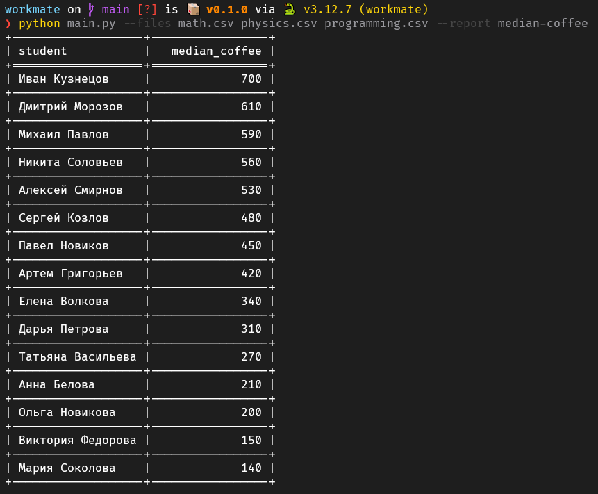

# Анализ данных о подготовке к экзаменам

Небольшой скрипт для формирования отчётов по данным о подготовке студентов к экзаменам из CSV-файлов.
На данный момент реализован отчёт median-coffee - медианная сумма трат на кофе по каждому студенту за весь период сессии.

Скрипт читает несколько CSV-файлов, объединяет данные, генерирует и выводит отчёт в консоль в виде таблицы. Отчёт сортируется по убыванию трат.

---

## Установка

Склонируйте репозиторий и установите зависимости:

```bash
git clone https://github.com/nobrainsjusttalking/workmate
cd workmate
uv sync
```

## Пример запуска

```bash
python main.py --files math.csv physics.csv programming.csv --report median-coffee
```


## Добавление нового отчёта

Для добавления нового отчёта:

1. Создайте класс отчёта в файле `report_types.py`.
2. Реализуйте метод `generate`.
3. Зарегистрируйте отчёт в словаре `REPORTS` в `main.py`.